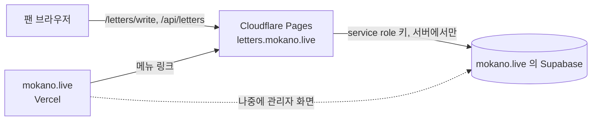

# 배포 가이드 — 모카에게 편지 쓰기

이 문서만 순서대로 따라 하면 편지 페이지를 인터넷에 올릴 수 있어요.

## 0. 전체 구조

편지 페이지는 **mokano.live 와 따로 배포되는 작은 서비스**예요.
mokano.live 코드(Next.js, Vercel)는 거의 건드리지 않고, **같은 Supabase DB 에 편지만 저장**해요.



| 부분 | 어디에 | 하는 일 |
|---|---|---|
| 편지 페이지 + API | Cloudflare Pages (이 저장소) | 화면 표시, 입력 검사, 48시간 제한, DB 저장 |
| DB | mokano.live 가 쓰는 Supabase 프로젝트 | 새 테이블 2개 + 함수 2개만 추가 |
| mokano.live | Vercel (Pink-Queen-Reigns 저장소) | 메뉴에 "모카에게 편지 쓰기" 링크만 추가 |

왜 따로 배포하나요?
- mokano.live 의 배포·PWA 캐시·관리자 로그인 구조에 영향을 주지 않아요.
- 편지 기능만 켜고 끄거나 되돌리기 쉬워요.
- 페이지와 API 가 같은 주소라 쿠키(48시간 제한)가 안정적으로 동작해요.

예상 주소 (예시): `https://letters.mokano.live/letters/write`
주소를 다르게 정해도 되고, 그 경우 아래 예시 주소만 바꿔서 따라 하면 돼요.

---

## 1. 준비물 체크

- [ ] GitHub 계정 (이 저장소를 올릴 곳)
- [ ] Cloudflare 계정 (무료 플랜으로 충분)
- [ ] mokano.live 의 **Supabase 대시보드** 접근 권한
- [ ] mokano.live 의 **Vercel 프로젝트** 접근 권한
- [ ] mokano.live **DNS 를 바꿀 수 있는 곳**의 접근 권한 (아래 5단계에서 확인)
- [ ] 내 컴퓨터: Node.js 20 이상, 이 저장소에서 `npm install` 완료

배포 전에 한 번 확인:

```powershell
npm test                 # 모두 pass 여야 해요
npm run build:functions  # "Compiled Worker successfully"
```

---

## 2. Supabase 에 테이블 만들기

### 2-1. 필수 SQL 실행

1. [Supabase 대시보드](https://supabase.com/dashboard) → mokano.live 프로젝트 선택
2. 왼쪽 메뉴 **SQL Editor** → **New query**
3. `supabase/migrations/20260926000000_create_moka_graduation_letters.sql` 파일 내용을 **전부** 복사해서 붙여 넣기
4. **Run** → 아래쪽에 `Success. No rows returned` 가 나오면 성공

- 새 테이블(`moka_graduation_letters`, `moka_graduation_letter_limits`)과 함수만 만들어요.
- 기존 `events`, `fan_messages`, `profiles` 등은 건드리지 않아요.
- 여러 번 실행해도 안전해요.

### 2-2. (선택) mokano.live 관리자용 정책

나중에 mokano.live 관리자 화면에서 편지를 보려면 실행해 두세요. 지금 안 해도 편지 저장에는 문제없어요.

1. 먼저 `is_admin()` 함수가 있는지 확인 (mokano.live 의 `supabase/rls.sql` 을 적용했다면 있어요):
   ```sql
   select proname from pg_proc where proname = 'is_admin';
   ```
   결과에 `is_admin` 이 한 줄 나오면 OK.
2. `supabase/migrations/20260926000100_moka_graduation_letters_admin_policies.sql` 내용을 붙여 넣고 **Run**

이러면 `profiles.role = 'admin'` 인 계정만 편지를 **읽고 검수 상태를 바꿀 수** 있어요.
본문 수정·삭제·추가는 관리자도 못 하고, 일반 로그인 사용자와 익명 사용자는 아무것도 못 봐요.

### 2-3. 잘 만들어졌는지 확인

SQL Editor 에서:

```sql
select public.get_moka_graduation_letter_status(repeat('a', 64));
```

`{"server_now_ms": ..., "next_allowed_at_ms": null}` 비슷한 결과가 나오면 성공이에요.

### 2-4. 서버 키 준비

**Project Settings → API Keys** 에서 두 가지를 메모장에 복사해 두세요. (다른 사람에게 보여 주면 안 돼요)

| 필요한 값 | 어디서 | 넣을 이름 |
|---|---|---|
| Project URL (`https://xxxx.supabase.co`) | API Keys 화면 상단 또는 Project Settings → Data API | `SUPABASE_URL` |
| 서버 전용 키 | 아래 중 하나 | `SUPABASE_SERVICE_ROLE_KEY` |

서버 전용 키 고르기:
- **추천:** "Publishable and secret API keys" 탭 → **Create new secret key** → 이름 `fan-letters` → 생성된 `sb_secret_...` 복사
  (편지 서비스 전용 키라서 문제가 생기면 이 키만 끌 수 있어요)
- 또는 "Legacy API keys" 탭의 `service_role` 키

> ⚠️ **키와 URL 은 반드시 같은 프로젝트**에서 복사하세요. 다른 프로젝트의 키를 넣으면 저장이 모두 실패해요.
> Cloudflare 에 넣기 전에 `.dev.vars` 에 같은 값을 넣고 확인하세요 (비밀값은 화면에 출력되지 않아요):
>
> ```powershell
> npm run check:config
> ```
>
> `✓ Supabase 연결 성공` 이 나오면 그 값 그대로 Cloudflare Secret 에 넣으면 돼요.

> ⚠️ mokano.live 저장소(Pink-Queen-Reigns)의 `.env.example` 에 실제 `service_role` 키로 보이는 값이 git 에 올라가 있어요.
> 이 키는 이미 노출된 것으로 보고 **교체(rotate)** 하는 것을 권장해요. 교체하면 mokano.live 의 Vercel 환경변수도 새 값으로 바꿔야 해요.
> 편지 서비스에는 위의 **전용 secret key** 를 쓰면 영향이 작아요.

---

## 3. 쿠키 서명용 비밀값 만들기

PowerShell 에서 실행하고 나온 값을 복사해 두세요 (`LETTER_COOKIE_SECRET`).

```powershell
$b = New-Object byte[] 32; [Security.Cryptography.RandomNumberGenerator]::Create().GetBytes($b); [Convert]::ToBase64String($b)
```

> 이 값은 한 번 정하면 바꾸지 마세요. 바꾸면 모든 브라우저의 48시간 기록이 초기화돼요.

---

## 4. Cloudflare Pages 에 올리기

### 방법 A: GitHub 연결 (추천 — push 하면 자동 배포)

1. 이 저장소를 GitHub 에 올려요.
   ```powershell
   git add -A
   git commit -m "모카에게 편지 쓰기"
   git push origin main
   ```
   `.dev.vars` 는 `.gitignore` 에 있어서 올라가지 않아요. `git status` 에 `.dev.vars` 가 보이면 멈추고 확인하세요.
2. [Cloudflare 대시보드](https://dash.cloudflare.com) → **Workers & Pages** → **Create** → **Pages** 탭 → **Connect to Git**
3. GitHub 권한을 주고 이 저장소 선택 → **Begin setup**
4. 설정값:

   | 항목 | 값 |
   |---|---|
   | Project name | `mokano-letters` (→ `https://mokano-letters.pages.dev`, `wrangler.toml` 의 `name` 과 같게) |
   | Production branch | `main` |
   | Framework preset | `None` |
   | Build command | 비워 두기 |
   | Build output directory | `public` |
   | Root directory | 비워 두기 |

   저장소의 `wrangler.toml` 에도 `pages_build_output_dir = "public"` 이 있어요.
5. **Save and Deploy** → 첫 배포가 끝날 때까지 기다려요. (아직 환경변수가 없어서 편지 저장은 안 돼요)
6. 프로젝트 → **Settings → Variables and Secrets** → **Add** (Production 환경), **Type: Secret** 으로 3개:

   | 이름 | 값 |
   |---|---|
   | `SUPABASE_URL` | 2-4 의 Project URL |
   | `SUPABASE_SERVICE_ROLE_KEY` | 2-4 의 서버 전용 키 |
   | `LETTER_COOKIE_SECRET` | 3 에서 만든 값 |

7. 환경변수는 **새 배포부터** 적용돼요. **Deployments** → 최신 배포의 `⋯` → **Retry deployment**

### 방법 B: 내 컴퓨터에서 직접 올리기 (CLI)

```powershell
npx wrangler login
npx wrangler pages project create mokano-letters --production-branch main
npx wrangler pages secret put SUPABASE_URL --project-name mokano-letters
npx wrangler pages secret put SUPABASE_SERVICE_ROLE_KEY --project-name mokano-letters
npx wrangler pages secret put LETTER_COOKIE_SECRET --project-name mokano-letters
npx wrangler pages deploy --project-name mokano-letters --branch main
```

`secret put` 은 값을 물어보면 붙여 넣고 Enter 를 눌러요. (화면에 값이 보이지 않아요)
이후 코드를 바꿀 때마다 마지막 줄(`pages deploy`)만 다시 실행하면 돼요.

---

## 5. 배포 주소에서 확인하기

`https://mokano-letters.pages.dev/letters/write` 를 열고:

- [ ] 페이지가 보이고, 버튼이 "확인하는 중…" → "편지 보내기" 로 바뀌어요
- [ ] 이름을 비우고 `[테스트] 배포 확인` 이라고 써서 보내면 "편지를 잘 받았어요." 가 나와요
- [ ] 새로고침하면 "조금만 쉬었다가 다시 써 주세요" 와 남은 시간이 보여요
- [ ] Supabase → **Table Editor** → `moka_graduation_letters` 에 `sender_name = NULL`, `moderation_status = pending` 인 행이 있어요

테스트 편지 지우기 (SQL Editor):

```sql
delete from public.moka_graduation_letters where content like '[테스트]%';
```

편지를 지워도 내 브라우저의 48시간 기록은 남아요. 다시 테스트하려면 다른 브라우저나 시크릿 창을 쓰세요.

API 만 따로 확인하고 싶으면:

```powershell
Invoke-WebRequest -UseBasicParsing https://mokano-letters.pages.dev/api/letters/status | Select-Object StatusCode, Content
```

`200` 과 `{"ok":true,"canSubmit":true,...}` 가 나오면 정상이에요.

---

## 6. 주소를 `letters.mokano.live` 로 연결하기 (선택, 추천)

### 6-1. mokano.live 의 DNS 가 어디 있는지 확인

```powershell
nslookup -type=ns mokano.live
```

| 결과에 보이는 것 | DNS 를 바꾸는 곳 |
|---|---|
| `ns1.vercel-dns.com` 등 | Vercel → **Domains** → `mokano.live` → DNS Records |
| `*.ns.cloudflare.com` | Cloudflare → `mokano.live` → DNS |
| 그 외 (가비아, 후이즈 등) | 도메인을 산 곳의 DNS 관리 화면 |

### 6-2. Cloudflare Pages 에 도메인 추가 (먼저!)

Pages 프로젝트 → **Custom domains** → **Set up a custom domain** → `letters.mokano.live` 입력 → **Continue**

> 순서가 중요해요. Pages 에 먼저 추가하지 않고 DNS 만 바꾸면 522 오류가 나요.

### 6-3. DNS 에 CNAME 추가

6-1 에서 찾은 곳에서 레코드를 추가해요.

| Type | Name | Value (Target) |
|---|---|---|
| `CNAME` | `letters` | `mokano-letters.pages.dev` |

- mokano.live 가 Cloudflare DNS 를 쓰면 6-2 에서 자동으로 만들어 주기도 해요.
- 몇 분~몇 시간 뒤 Pages 의 Custom domains 상태가 **Active** 가 되면 끝이에요. HTTPS 인증서도 자동이에요.
- 확인: `https://letters.mokano.live/letters/write`

---

## 7. mokano.live 메뉴에 링크 켜기

mokano.live(Pink-Queen-Reigns)에는 링크 코드가 이미 들어가 있고, **환경변수가 있을 때만** 보여요.
(데스크톱 상단 메뉴, 모바일은 **프로필 → 비공식 링크**)

1. Pink-Queen-Reigns 변경 사항을 커밋·push 해요.
2. Vercel → mokano.live 프로젝트 → **Settings → Environment Variables** → **Add**
   - Key: `NEXT_PUBLIC_FAN_LETTER_URL`
   - Value: `https://letters.mokano.live/letters/write` (6단계를 안 했다면 `https://mokano-letters.pages.dev/letters/write`)
   - Environment: Production
3. `NEXT_PUBLIC_` 값은 빌드할 때 들어가요. **Deployments → 최신 배포 `⋯` → Redeploy** 를 눌러야 반영돼요.
4. mokano.live 에서 링크가 보이고 누르면 편지 페이지로 가는지 확인해요.

링크를 숨기고 싶으면 이 환경변수를 지우고 다시 Redeploy 하면 돼요.

일본 팬에게 공유할 때는 주소 뒤에 `?lang=ja` 를 붙이면 처음부터 일본어로 열려요 (예: `https://letters.mokano.live/letters/write?lang=ja`).
주소에 `lang` 이 없으면 브라우저 언어가 일본어일 때 자동으로 일본어, 그 외에는 한국어로 열려요.

편지 페이지의 "모카 한 모금으로 돌아가기" 는 `https://mokano.live/` 로 연결돼 있어요 (`public/letters/write.html`).

---

## 8. (선택) 짧은 시간 연속 요청 막기

`mokano.live` 도메인이 **Cloudflare DNS** 에 있을 때만 쓸 수 있어요.
Cloudflare → `mokano.live` → **Security → WAF → Rate limiting rules** → Create rule:

- 조건: URI Path equals `/api/letters` AND Request Method equals `POST`
- 기준: IP, **10초에 10번** 초과 시 → Block, 차단 시간 10초

IP 를 오래(예: 48시간) 막지 마세요. 같은 와이파이의 다른 팬까지 막혀요.
Vercel 이나 다른 곳의 DNS 를 쓰면 이 단계는 건너뛰어도 돼요. 48시간 제한은 DB 에서 그대로 동작해요.

---

## 9. 운영하면서

| 하고 싶은 일 | 방법 |
|---|---|
| 들어온 편지 보기 | Supabase → Table Editor → `moka_graduation_letters` (관리자 화면이 생기기 전까지) |
| 검수 처리 | 같은 표에서 `moderation_status` 를 `approved` 또는 `hidden` 으로, `reviewed_at` 에 현재 시각 |
| 서버 로그 보기 | Cloudflare Pages → 프로젝트 → **Deployments** → 배포 선택 → **Functions** 탭 → Begin log stream (오류 코드만 남고 편지 내용은 안 남아요) |
| 이전 버전으로 되돌리기 | Pages → **Deployments** → 원하는 배포 `⋯` → **Rollback to this deployment** |
| 잠시 편지 받기 중단 | Pages 에서 `SUPABASE_SERVICE_ROLE_KEY` 를 지우고 Retry deployment → 화면에 "지금은 편지를 받을 준비가 되지 않았어요" 표시 |
| 서버 키 교체 | Supabase 에서 새 secret key 만들기 → Pages 의 `SUPABASE_SERVICE_ROLE_KEY` 바꾸기 → Retry deployment → 예전 키 삭제 |
| 코드 수정 반영 | 방법 A: `git push` / 방법 B: `npx wrangler pages deploy --project-name mokano-letters --branch main` |

`created_at` 등 시각은 **진짜 UTC** 로 저장돼요 (mokano.live 의 `events` 처럼 KST 벽시계를 `+00` 으로 넣는 방식이 아니에요).
화면에 보여 줄 때는 KST(+9시간)로 바꿔서 보여 주세요.

---

## 10. 문제가 생겼을 때

| 증상 | 원인 | 해결 |
|---|---|---|
| `/letters/write` 가 404 | 출력 폴더 설정이 틀림 | Build output directory 를 `public` 으로 → 다시 배포 |
| "지금은 편지를 받을 준비가 되지 않았어요" (500 `server_misconfigured`) | 환경변수가 없거나 틀림, 추가 후 재배포를 안 함 | Functions 로그의 `server misconfigured: ...` 문구가 원인이에요. 로컬에서 `npm run check:config` 로 확인 후 4단계 6~7 |
| 로그에 `belongs to project "A" but SUPABASE_URL is project "B"` | **다른 Supabase 프로젝트의 키**를 넣음 | `SUPABASE_URL` 프로젝트(B)의 API Keys 화면에서 키를 다시 복사 → Secret 교체 → Retry deployment |
| 로그에 `Supabase rejected SUPABASE_SERVICE_ROLE_KEY` | 키가 폐기되었거나 다른 프로젝트 키(`sb_secret_` 키는 미리 확인 불가) | 위와 같이 키 교체 |
| 로그에 `letter RPC not found` | 2-1 SQL 을 실행하지 않음 | 2-1 실행 |
| "편지함이 잠시 응답하지 않아요" (503) | Supabase 일시 장애 | 잠시 후 다시. 계속되면 Supabase 상태 페이지 확인 |
| "이 주소에서는 편지를 보낼 수 없어요" (403) | 다른 도메인에서 프록시함 | `LETTER_ALLOWED_ORIGINS` 에 그 주소(예: `https://mokano.live`)를 넣고 재배포 |
| 쿠키 안내가 계속 나옴 (428) | 브라우저가 쿠키를 막음 | 사이트 데이터(쿠키) 허용 안내. 서버는 정상 |
| 커스텀 도메인 522 / 인증서 대기 | CNAME 이 아직 없거나 전파 중 | 6-2 → 6-3 순서 확인, 잠시 기다리기 |
| mokano.live 에 링크가 안 보임 | 환경변수 추가 후 Redeploy 안 함 | 7단계 3 |

---

## 11. 최종 체크리스트

- [ ] Supabase: 2-1 SQL 실행 (필요하면 2-2 도)
- [ ] 전용 secret key 발급, mokano.live 의 노출된 키 교체 검토
- [ ] `npm run check:config` → `✓ Supabase 연결 성공`
- [ ] Cloudflare Pages: 출력 폴더 `public`, Secret 3개, 재배포
- [ ] pages.dev 주소에서 테스트 편지 → Supabase 에 `pending` 확인 → 테스트 편지 삭제
- [ ] (선택) `letters.mokano.live` 연결
- [ ] mokano.live: `NEXT_PUBLIC_FAN_LETTER_URL` 설정 → Redeploy → 링크 확인
